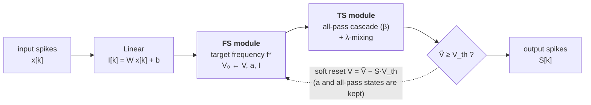

<div align="center">

# FiTS: Interpretable Spiking Neurons via<br>Frequency Selectivity and Temporal Shaping

[](https://arxiv.org/abs/2605.13071)
[](https://openreview.net/forum?id=xukoeVXJJ9)
[](https://openreview.net/forum?id=xukoeVXJJ9)
[](https://pytorch.org)
[](https://github.com/triton-lang/triton)
[](LICENSE)

[**Jongmin Choi**](https://cjongmin.github.io)&nbsp;&nbsp;·&nbsp;&nbsp;**Joon Son Chung**

KAIST

*NeurIPS 2026 · Spotlight*

</div>

---

## 📣 News

- **2026.09** 🎖️ FiTS is accepted to **NeurIPS 2026** as a **Spotlight** (292 of 30,709 submissions, 0.95%).

## ✨ Overview

**FiTS** is a spiking neuron that splits the temporal computation of each neuron into two explicit, learnable parts:

- **Frequency Selectivity (FS)** — every neuron has a **target frequency f\*** at which its subthreshold response peaks. A closed-form map (Theorem 1) turns f\* into the adaptation coupling κ = ηγ, so f\* is at once the **initialization**, the **learned parameter** and the **readout**.
- **Temporal Shaping (TS)** — an M-stage all-pass cascade with learnable λ-mixing reshapes the **group delay**, i.e. *when* frequency components reach the threshold, without changing *which* frequencies are emphasized. λ-mixing can even produce group-delay *advances*.

In plain feedforward SNNs (no recurrence, no network-level delays), FiTS consistently improves over LIF on auditory benchmarks and stays competitive with recurrent and delay-based models. After training, each neuron is summarized by readable quantities: its target frequency and its TS group-delay shift.



<details>
<summary><b>Discrete-time update (Algorithm 1)</b></summary>

With μ = 1/τ<sub>m</sub>, ρ = 1/τ<sub>a</sub> and time step Δt:

```text
FS   V₀[k+1] = (1 − μΔt)·V[k] − ηΔt·a[k] + I[k]
     a[k+1]  = (1 − ρΔt)·a[k] + γΔt·V₀[k+1]              (semi-implicit Euler)

TS   V_m[k+1] = β_m·(V_m[k] − V_{m−1}[k+1]) + V_{m−1}[k]  (all-pass stage m = 1..M)
     Ṽ = V_M;  Ṽ ← (1 − λ_m)·V_{m−1}[k+1] + λ_m·Ṽ   for m = M, …, 1
     e.g. M = 1: Ṽ = (1 − λ₁)V₀ + λ₁V₁
          M = 2: Ṽ = (1 − λ₁)V₀ + λ₁[(1 − λ₂)V₁ + λ₂V₂]

Spike S[k+1] = Θ(Ṽ[k+1] − V_th)
     V[k+1]  = Ṽ[k+1] − S[k+1]·V_th                       (subtractive soft reset)
```

κ = ηγ is computed from f\* on every forward pass (η = γ), β<sub>m</sub> = tanh(·) ∈ (−1, 1) and λ<sub>m</sub> = sigmoid(·) ∈ (0, 1).
The reset acts on the membrane voltage only: the adaptation state `a` and the all-pass states are carried through spikes, so the TS phase memory is not cleared by firing.

</details>

## 📦 Installation

```bash
git clone https://github.com/kaistmm/FiTS.git && cd FiTS
conda create -n fits python=3.10 -y && conda activate fits

# PyTorch for your CUDA version (the Linux CUDA wheels include Triton)
pip install torch torchvision --index-url https://download.pytorch.org/whl/cu121
pip install -r requirements.txt
pip install -e .            # makes `import fits` available everywhere
```

Developed with Python 3.10, PyTorch 2.5.1 (CUDA 12.1) and Triton 3.1.0 on NVIDIA RTX A5000 GPUs. Without a GPU, everything runs on the PyTorch backend (slower, same results).

## 🚀 Use FiTS in your own model

`FiTSNeuron` is a drop-in spiking layer: a linear projection followed by the FiTS dynamics over the whole sequence.

```python
import torch
from fits import FiTSNeuron, FrequencyGuard

layer = FiTSNeuron(
    in_features=140, out_features=256,
    order=1,                        # TS cascade order M (0 = FS only)
    tau_m=0.04, tau_a=0.2, dt=0.004,  # membrane / adaptation time constants, time step (s)
    f_min=1.0, f_max=50.0,          # initial target frequencies, log-spaced (Hz)
).cuda()

x = (torch.rand(32, 250, 140, device="cuda") < 0.05).float()   # [batch, time, features]
spikes, v, a, w1, w2 = layer(x)                                  # spikes: [32, 250, 256]

optimizer = torch.optim.Adam(layer.parameters(), lr=1e-3)
FrequencyGuard(layer, optimizer)    # keep f* inside the stable region (see below)
```

Pick `dt` equal to your input bin width and `f_min`/`f_max` inside the band your inputs carry. A complete runnable example is [`examples/quickstart.py`](examples/quickstart.py).

<details>
<summary><b>All <code>FiTSNeuron</code> options</b></summary>

| argument | default | meaning |
|---|---|---|
| `order` | `1` | TS cascade order M; `0` is the FS-only neuron |
| `tau_m`, `tau_a`, `dt` | `0.04`, `0.2`, `0.004` | membrane / adaptation time constants and time step (s) |
| `f_min`, `f_max` | `1.0`, `50.0` | range of the **initial** f\* (Hz); f\* is not clamped during training |
| `freq_init` | `"log"` | `"log"` (paper), `"linear"`, or `"constant"` (all at √(f_min·f_max)) |
| `learn_freq` | `True` | `False` freezes f\* at its initialization |
| `freq_param` | `"ct"` | `"ct"`: continuous-time map of Theorem 1 (paper); `"dt"`: exact discrete-time map, the update peaks exactly at f\* |
| `implicit` | `True` | semi-implicit (paper) or explicit Euler FS update |
| `v_threshold` | `1.0` | firing threshold |
| `surrogate_type`, `surrogate_alpha` | `0`, `2.0` | 0 = triangle (paper), 1 = arctan, 2 = sigmoid |
| `lam_init` | `-3.0` | initial λ logit (λ ≈ 0.047, i.e. close to FS only) |
| `ratio_eta_gamma` | `1.0` | η/γ |
| `backend` | `"auto"` | `"triton"`, `"torch"`, or `"auto"` (Triton for CUDA inputs) |
| `chunk_size` | `256` | time steps per kernel launch; tiling only, results are unchanged |

</details>

## 🔍 Reading out what each neuron learned

Every neuron exposes its frequency and timing role directly:

```python
layer.get_freq()          # target frequency f* of each neuron (Hz) — the learned FS coordinate
layer.realized_freq()     # peak realized by the discrete-time FS update, f*_DT (Hz)
layer.ts_group_delay()    # group delay the TS module adds at each neuron's f* (s); < 0 = advance
layer.get_lam_list()      # TS mixing weights λ_1..λ_M
layer.get_beta_list()     # all-pass coefficients β_1..β_M
```

For a trained checkpoint, [`examples/inspect_checkpoint.py`](examples/inspect_checkpoint.py) prints these per layer and can export them:

```bash
python examples/inspect_checkpoint.py runs/gsc/fits_o1_w512/best.pth --csv neurons.csv --plot fstar.png
```

## ⚡ Why a fused Triton kernel works here

The FiTS update is recurrent *within* each neuron (V, a and the all-pass states), but neurons in a layer interact only through the input current I[k] = W·x[k] + b. In a feedforward network, x is the spike train of the layer below, which is complete before this layer runs. So each layer is computed in two steps:

1. one GEMM gives I for all T time steps;
2. one Triton program per block of (sample, neuron) pairs runs the whole time loop in registers — FS update, all-pass cascade, λ-mixing, spike and soft reset — and a second kernel runs the backward pass in reverse time.

The time loop itself stays sequential (the threshold and reset are nonlinear, so there is no parallel scan); the speed-up of **31–135×** over a PyTorch time loop (paper, Table A.3) comes from replacing T small kernel launches with one and keeping the state on-chip.

**The requirement:** the input current of a layer must not depend on spikes of the same layer (or of later layers) at earlier time steps.

| works with the fused kernel | needs a different implementation |
|---|---|
| stacked feedforward layers, residual/skip connections | recurrent weights, I[k] = W·x[k] + W<sub>rec</sub>·S[k−1] |
| convolutional or other front-ends applied to the whole sequence | recurrent (feedback) delays |
| feedforward synaptic delays applied to the input sequence (e.g. DCLS) | lateral inhibition, top-down feedback |

With recurrent weights, every step needs a matrix product over all neurons' previous spikes, so neurons can no longer be advanced independently through time. Such models can still use `backend="torch"` as a starting point (a step-by-step loop), or a kernel that interleaves a per-step GEMM.

## 📊 Reproducing the paper

### Data

| dataset | how to get it | expected layout (`--data-dir`) |
|---|---|---|
| SHD | [zenkelab.org/datasets](https://zenkelab.org/datasets/), then `gunzip` | `shd_train.h5`, `shd_test.h5` |
| SSC | [zenkelab.org/datasets](https://zenkelab.org/datasets/), then `gunzip` | `ssc_train.h5`, `ssc_valid.h5`, `ssc_test.h5` |
| GSC v0.02 | downloaded and split automatically on first run, or `python -m experiments.gsc.prepare --data-dir data/GSC/processed` | `train/`, `valid/`, `test/` (one folder per class) |
| sMNIST | downloaded automatically by torchvision | — |

### Training

All commands run from the repository root. Each config reproduces one headline setting of the paper; any key can be overridden on the command line.

```bash
python -m experiments.shd.train    --config configs/shd/fits_o1_w128.yaml       --data-dir data/SHD
python -m experiments.shd.train    --config configs/shd/fits_o2_w256_valid.yaml --data-dir data/SHD
python -m experiments.ssc.train    --config configs/ssc/fits_o1_w512.yaml       --data-dir data/SSC
python -m experiments.gsc.train    --config configs/gsc/fits_o1_w512.yaml       --data-dir data/GSC/processed
python -m experiments.smnist.train --config configs/smnist/fits_o1_w256.yaml    --data-dir data/MNIST
```

| benchmark | protocol | config | M | width | params | paper acc. (%) |
|---|---|---|:-:|:-:|:-:|:-:|
| SHD | best test | [`shd/fits_o1_w128.yaml`](configs/shd/fits_o1_w128.yaml) | 1 | 128 | 0.04 M | 95.31 ± 0.21 |
| SHD\* | 20% validation hold-out | [`shd/fits_o2_w256_valid.yaml`](configs/shd/fits_o2_w256_valid.yaml) | 2 | 256 | 0.11 M | 94.38 ± 0.12 |
| SSC | official validation split | [`ssc/fits_o1_w512.yaml`](configs/ssc/fits_o1_w512.yaml) | 1 | 512 | 0.35 M | 78.23 ± 0.16 |
| GSC | official validation split | [`gsc/fits_o1_w512.yaml`](configs/gsc/fits_o1_w512.yaml) | 1 | 512 | 0.30 M | 94.48 ± 0.12 |
| sMNIST | best test | [`smnist/fits_o1_w256.yaml`](configs/smnist/fits_o1_w256.yaml) | 1 | 256 | 0.07 M | 98.28 |

Training is short: one run with the paper settings takes about 7 min (SHD), 24 min (GSC) or 70 min (SSC) on a single RTX A5000 (paper, Table A.4).

Each run writes `train.log`, `config.json`, `metrics.json` (per-epoch curves), `summary.json` and `best.pth` to `results_dir`. For several seeds:

```bash
SEEDS="0 1 2 3 4" bash scripts/run_seeds.sh gsc configs/gsc/fits_o1_w512.yaml --data-dir data/GSC/processed
```

<details>
<summary><b>Ablations: LIF → adaptive LIF → FS → FS + TS (paper Table 3)</b></summary>

The baselines run through the same kernel, so the discretization is identical to FiTS. The paper tunes the learning rate and dropout per variant and width (Table A.2); set them with `--lr` / `--dropout`.

```bash
CFG=configs/ssc/fits_o1_w512.yaml
python -m experiments.ssc.train --config $CFG --neuron-type lif          --results-dir runs/ssc/lif
python -m experiments.ssc.train --config $CFG --neuron-type adaptive_lif --results-dir runs/ssc/adaptive_lif
python -m experiments.ssc.train --config $CFG --order 0 --learn-freq false --results-dir runs/ssc/fs_frozen
python -m experiments.ssc.train --config $CFG --order 0                    --results-dir runs/ssc/fs
python -m experiments.ssc.train --config $CFG --order 2                    --results-dir runs/ssc/fs_ts_o2
```

Other useful switches: `--freq-init linear|constant`, `--freq-param dt`, `--hidden-dims 256 256`, `--backend torch`.

</details>

### Numerical stability of f\*

f\* is not clamped during training. The semi-implicit FS update is stable only while κΔt² < (1 + μ̄)(1 + ρ̄) (Jury criterion, μ̄ = 1 − μΔt, ρ̄ = 1 − ρΔt), and with the continuous-time map κ grows roughly like f\*², so each (τ<sub>m</sub>, τ<sub>a</sub>, Δt) has a critical frequency, `fits.critical_freq(...)`: **77.2 Hz** for SHD/SSC and **30.9 Hz** for GSC, whose initial range [1, 30] Hz sits just below it. A neuron pushed past this limit diverges and stops carrying information.

The training scripts therefore enable `FrequencyGuard` by default (`freq_guard: true`). After each optimizer step it projects f\* back below 98% of the limit, handling Adam momentum so that neurons at the cap can still move down. It never changes the forward pass, so a run whose f\* stays below the cap is identical to an unguarded one. Set `freq_guard: false` to train without it, or use `freq_param: dt`, whose exact discrete-time map keeps κ inside the stable region up to Nyquist for these constants.

## 🗂️ Repository structure

```text
fits/                        the FiTS package (pip install -e .)
├── neuron.py                FiTSNeuron layer, LIF / adaptive-LIF baselines, readouts
├── frequency.py             f* ↔ κ maps (Theorem 1 and its exact discrete-time version), stability bound
├── stability.py             FrequencyGuard (projected optimization of f*)
├── models.py                FiTSNet: feedforward SNN used in the paper, build_model(config)
├── reference.py             plain PyTorch time loop (CPU fallback, any order, test reference)
└── kernels/                 fused Triton forward/backward kernels (M ≤ 5) and surrogate gradients
experiments/                 training scripts: shd/, ssc/, gsc/, smnist/ (+ shared common.py, spike_data.py)
configs/                     one YAML per headline result
examples/                    quickstart.py, inspect_checkpoint.py
scripts/                     run_seeds.sh, summarize.py
tests/                       pytest suite (Triton-vs-reference tests run when CUDA is available)
```

Run the tests with `pip install pytest && python -m pytest tests`.

## 📖 Citation

```bibtex
@inproceedings{choi2026fits,
  title     = {{FiTS}: Interpretable Spiking Neurons via Frequency Selectivity and Temporal Shaping},
  author    = {Choi, Jongmin and Chung, Joon Son},
  booktitle = {Advances in Neural Information Processing Systems (NeurIPS)},
  year      = {2026}
}
```

## 🙏 Acknowledgments

The SHD and SSC datasets are provided by [Cramer et al.](https://zenkelab.org/datasets/) and Google Speech Commands by [Warden](https://arxiv.org/abs/1804.03209).

## 📄 License

This code is released under the [Apache-2.0](LICENSE) license. Datasets keep their original licenses.
